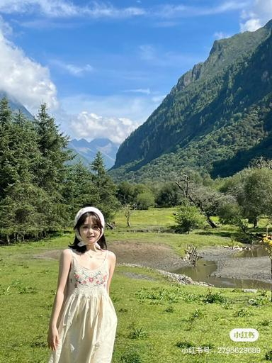
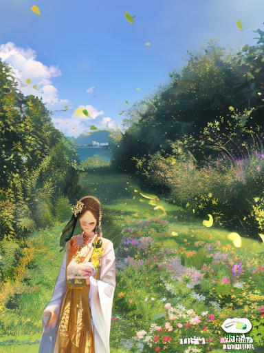
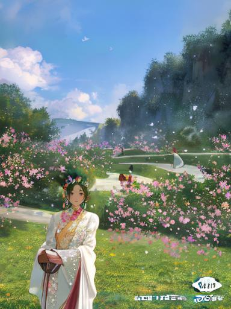
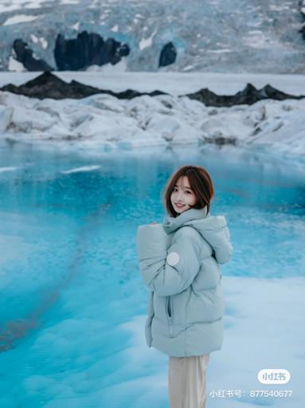
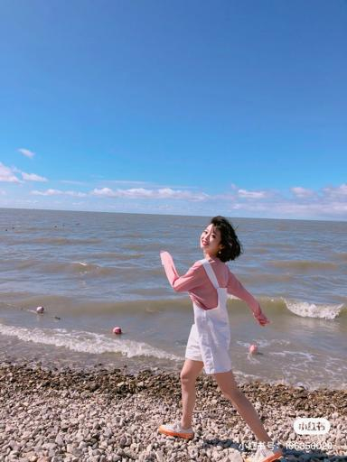
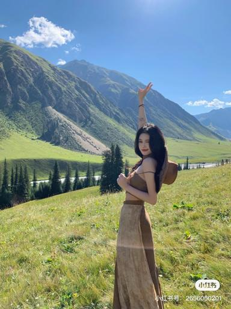
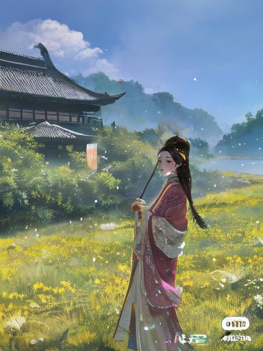
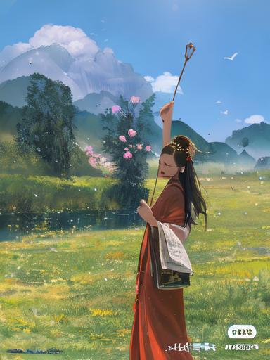

## Face Refinement

人脸修复，多用于小人脸丑陋、模糊的修复。大人脸也可以用，但是感觉没太大必要

<div align=center>

</div>

使用方法

```python
from redpy.diffusers_custom import StableDiffusionCommonPipeline
from redpy.diffusers_custom import face_refinement
from redpy.grpc import CommonClient
from PIL import Image

# load pipeline
# Face Refinement 需要 Face Controlnet 支持, 确保controlnet中存在
base_model = 'base_model path'
controlnet_path_list = ['controlnet-face path', "other controlnet-xxx"]
pipe = StableDiffusionCommonPipeline.from_pretrained(base_model, controlnet_list=controlnet_path_list, safety_checker=None, feature_extractor=None)

# input_image
input_image = Image.open('image file path').convert('RGB')

# step 1. 输出一个 output image
image = pipe.img2img(
    image=input_image,
    strength=0.6,
    prompt='your prompt',
    negative_prompt='your negative_prompt',
).images[0]

# step 2. 准备人脸信息，人脸服务已经部署完毕
client_face = CommonClient(ip='x.x.x.x', port='xxxx')
control_image_bgr = np.array(input_image)[..., ::-1]
face_info = client_face.run([control_image_bgr])

# step 3. 人脸修复
for idx in range(len(face_info)):
    face_emb = face_info[idx]['embedding']
    face_kps = face_info[idx]['kps']
    face_bbox = face_info[idx]['bbox']
    gender = face_info[idx]['gender']
    age = face_info[idx]['age']

    image = face_refinement(
        img_pil=image, 
        pipe=pipe, 
        bbox=face_bbox, 
        kps=face_kps, 
        embs=face_emb, 
        gender=gender, 
        age=age, 
        prompt=prompt, 
        negative_prompt=negative_prompt,
        strength=0.6,
        guidance_scale=5.,
        num_inference_steps=30,
    )
```

一些例子

input| img2img | face crop | face kps | face refinement | output 
:-------------------------:|:-------------------------:|:-------------------------:|:-------------------------:|:-------------------------:|:-------------------------:
|||||
|||||
|||||
|||||
|||||
|||||
|||||
|||||


